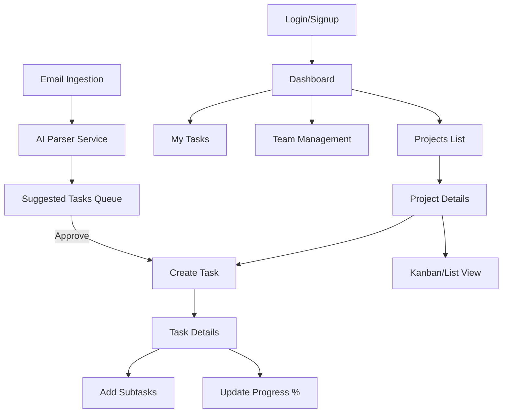

# AI Task Tracker - Project Design Document

## 1. Product Requirements (PRD)
**Goal**: Build an AI-driven Task Tracking Tool that handles manual and automated (email-based) task creation, with robust team and project management features.

### Core Features
*   **User & Teams**: Hierarchy-based team management.
*   **Projects**: Group tasks into projects.
*   **Task Management**:
    *   Manual Creation.
    *   **AI Email Parser**: Parse emails to suggest tasks/history.
    *   Subtasks support.
    *   Progress tracking (0-100%).
*   **Dashboard**: Key metrics, alerts for overdue items.

---

## 2. User Flow & Screen Flow

### High-Level Flow

### UI Mockups

#### Main Dashboard
The central hub for users to see their performance metrics and upcoming deadlines.

#### Task Board (Project View)
A visual interface for managing tasks within a project, showing status and details.

---

## 3. Database Schema (PostgreSQL)

We will use `sqlx` with PostgreSQL. Below is the detailed schema design.

### `users`
| Column | Type | Constraints | Description |
| :--- | :--- | :--- | :--- |
| `id` | `UUID` | `PRIMARY KEY` | Unique user ID |
| `email` | `VARCHAR(255)` | `UNIQUE, NOT NULL` | User email |
| `password_hash` | `VARCHAR` | `NOT NULL` | Hashed password |
| `full_name` | `VARCHAR(100)` | `NOT NULL` | Display name |
| `role` | `VARCHAR(50)` | `DEFAULT 'member'` | admin, manager, member |
| `created_at` | `TIMESTAMPTZ` | `DEFAULT NOW()` | |

### `teams`
| Column | Type | Constraints | Description |
| :--- | :--- | :--- | :--- |
| `id` | `UUID` | `PRIMARY KEY` | Unique team ID |
| `name` | `VARCHAR(100)` | `NOT NULL` | Team name |
| `parent_team_id` | `UUID` | `FOREIGN KEY (teams.id)` | For hierarchy (optional) |
| `manager_id` | `UUID` | `FOREIGN KEY (users.id)` | Team lead |

### `team_members` (Join Table)
| Column | Type | Constraints | Description |
| :--- | :--- | :--- | :--- |
| `team_id` | `UUID` | `FOREIGN KEY` | |
| `user_id` | `UUID` | `FOREIGN KEY` | |
| `joined_at` | `TIMESTAMPTZ` | `DEFAULT NOW()` | |

### `projects`
| Column | Type | Constraints | Description |
| :--- | :--- | :--- | :--- |
| `id` | `UUID` | `PRIMARY KEY` | |
| `name` | `VARCHAR(150)` | `NOT NULL` | |
| `description` | `TEXT` | | |
| `team_id` | `UUID` | `FOREIGN KEY` | Owner team |
| `created_by` | `UUID` | `FOREIGN KEY` | Creator |

### `tasks`
| Column | Type | Constraints | Description |
| :--- | :--- | :--- | :--- |
| `id` | `UUID` | `PRIMARY KEY` | |
| `project_id` | `UUID` | `FOREIGN KEY` | |
| `title` | `VARCHAR(255)` | `NOT NULL` | |
| `description` | `TEXT` | | |
| `status` | `VARCHAR(50)` | `DEFAULT 'todo'` | todo, in_progress, done |
| `progress_percent` | `INT` | `CHECK (0-100)` | Manual % tracking |
| `priority` | `VARCHAR(20)` | `DEFAULT 'medium'` | low, medium, high, urgent |
| `assignee_id` | `UUID` | `FOREIGN KEY (users.id)` | |
| `due_date` | `TIMESTAMPTZ` | | |
| `source_email_id` | `VARCHAR` | | ID if created via email |

### `subtasks`
| Column | Type | Constraints | Description |
| :--- | :--- | :--- | :--- |
| `id` | `UUID` | `PRIMARY KEY` | |
| `parent_task_id` | `UUID` | `FOREIGN KEY (tasks.id)` | |
| `title` | `VARCHAR(255)` | `NOT NULL` | |
| `is_completed` | `BOOLEAN` | `DEFAULT FALSE` | |

### `email_logs` (For AI Context)
| Column | Type | Constraints | Description |
| :--- | :--- | :--- | :--- |
| `id` | `UUID` | `PRIMARY KEY` | |
| `sender` | `VARCHAR(255)` | | |
| `subject` | `VARCHAR(255)` | | |
| `body_text` | `TEXT` | | |
| `received_at` | `TIMESTAMPTZ` | | |
| `processed` | `BOOLEAN` | `DEFAULT FALSE` | Has AI processed it? |
